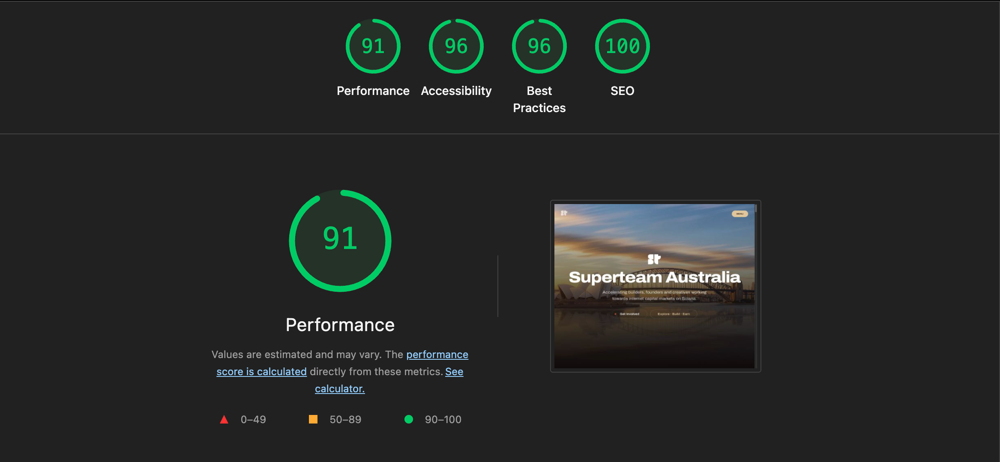

<p align="center">
  
</p>

<h1 align="center">Superteam Australia</h1>

<p align="center">
  <strong>Accelerating builders, founders, and creatives working towards Solana Ecosystem — rooted in the spirit of Australia.</strong>
</p>

<p align="center">
  <a href="https://main.d3kyz81mk7nvl4.amplifyapp.com/">🌏 Live Demo</a> &nbsp;·&nbsp;
  <a href="#-tech-stack">Tech Stack</a> &nbsp;·&nbsp;
  <a href="#-getting-started">Getting Started</a> &nbsp;·&nbsp;
  <a href="#-architecture">Architecture</a> &nbsp;·&nbsp;
  <a href="DESIGN_RATIONALE.md">Design Rationale</a> &nbsp;·&nbsp;
  <a href="https://www.figma.com/design/AJjFP2GvQ2EzFRoTPrXUZf/Superteam---AU?node-id=0-1&p=f">Figma Design</a>
</p>

<br />

<p align="center">
  
</p>

<p align="center"><em>Lighthouse audit — all scores in the green</em></p>

---

## 🌿 Project Overview

**Superteam Australia** is a full-stack, production-grade community platform for the Solana ecosystem in Australia. It serves as the digital front door for builders, founders, and creatives to discover events, connect with members, and get involved with the Solana movement across Australia.

### Design Philosophy — *Earthy Australia*

The entire visual identity is inspired by the **Australian landscape** — from the sun-scorched ochre of Uluru, to the deep teal of the Great Barrier Reef, to the golden light of the Outback at dusk. We deliberately chose an **earthy colour palette** that feels warm, grounded, and unmistakably Australian:

| Swatch | Colour | Hex | Inspired By |
|--------|--------|-----|-------------|
| 🟤 | **Background** | `#100B0A` | Australian night sky over the Outback |
| 🔶 | **Primary (Rust)** | `#B54B33` | Red earth of Uluru & the Red Centre |
| 🟢 | **Secondary (Teal)** | `#00A896` | Waters of the Great Barrier Reef |
| 🟡 | **Accent (Gold)** | `#E1C699` | Golden wattle & Outback sunsets |
| ⬜ | **Foreground** | `#F5EDE6` | Weathered sandstone & coastal cliffs |
| 🟫 | **Muted** | `#1E1412` | Eucalyptus bark in moonlight |

Every colour was chosen to evoke a sense of place — so that the moment you land on the site, you *feel* Australia.

### Key Features

- **Cinematic landing page** with WebGL particles, 3D card transforms, GSAP scroll-driven animations, and parallax effects
- **Smooth-scroll experience** powered by Lenis with spring-physics easing
- **Hero image slider** showcasing iconic Australian landmarks — Sydney Opera House, Great Barrier Reef, Twelve Apostles, Uluru
- **Dynamic content** — events, members, stats, FAQs, partners — all fetched from Supabase in real time
- **Multi-step onboarding form** for community sign-ups with server actions
- **Admin dashboard** with full CRUD, image uploads, event calendar, and content management
- **Luma integration** for event ticketing and RSVPs
- **100% custom-designed components** — no off-the-shelf templates, every section hand-crafted

---

## 🛠 Tech Stack

| Layer | Technology | Purpose |
|-------|-----------|---------|
| **Framework** | Next.js 16 (App Router) | Server components, SSR, routing |
| **Language** | TypeScript 5 | End-to-end type safety |
| **UI Library** | React 19 | Latest hooks & concurrent features |
| **Styling** | Tailwind CSS 4 | Utility-first, dark theme, responsive |
| **Animation** | Framer Motion 12 | Spring physics, gestures, layout animations |
| **Animation** | GSAP 3.14 + ScrollTrigger | Scroll-driven animations, scrubbing |
| **3D / WebGL** | OGL 1.0 | Custom GLSL shader particle system |
| **Smooth Scroll** | Lenis 1.3 | Buttery-smooth page scrolling |
| **Backend / DB** | Supabase (PostgreSQL) | Real-time database, auth, storage |
| **Icons** | Tabler Icons | 4,000+ open-source SVG icons |
| **Primitives** | Radix UI | Accessible, unstyled component primitives |
| **Markdown** | React Markdown + remark-gfm | Rich text rendering |
| **Deployment** | AWS Amplify | CI/CD, custom domain, SSL |
| **Fonts** | Archivo (variable) + Geist Mono | Typography system |

---

## 🏗 Architecture

```
┌─────────────────────────────────────────────────────────────────────┐
│                         AWS AMPLIFY (CDN + CI/CD)                   │
│                   main.d3kyz81mk7nvl4.amplifyapp.com                │
└──────────────────────────────┬──────────────────────────────────────┘
                               │
                               ▼
┌─────────────────────────────────────────────────────────────────────┐
│                        NEXT.JS 16 (APP ROUTER)                      │
│                                                                     │
│  ┌───────────────┐  ┌──────────────┐  ┌────────────────────────┐    │
│  │  Server       │  │  Client      │  │  Server Actions        │    │
│  │  Components   │  │  Components  │  │  (form submissions)    │    │
│  │  (SSR/SSG)    │  │  (Hydrated)  │  │                        │    │
│  └──────┬────────┘  └──────┬───────┘  └────────────┬───────────┘    │
│         │                  │                       │                │
│         ▼                  ▼                       ▼                │
│  ┌──────────────────────────────────────────────────────────────┐   │
│  │                     COMPONENT LAYER                          │   │
│  │                                                              │   │
│  │  ┌──────────────┐ ┌──────────────┐ ┌──────────────────────┐  │   │
│  │  │  Sections/   │ │  Animations/ │ │  UI Components       │  │   │
│  │  │  ─────────   │ │  ──────────  │ │  ──────────────      │  │   │
│  │  │  Hero        │ │  ScrollReveal│ │  3D Cards            │  │   │
│  │  │  Mission     │ │  Parallax    │ │  WebGL Particles     │  │   │
│  │  │  Stats       │ │  CountUp     │ │  Creative Buttons    │  │   │
│  │  │  Events      │ │  SplitText   │ │  Circular Text       │  │   │
│  │  │  Members     │ │  Spotlight   │ │  Image Slider        │  │   │
│  │  │  Ecosystem   │ │  StickyScroll│ │  Profile Cards       │  │   │
│  │  │  Community   │ │  HeroHighlght│ │  Link Previews       │  │   │
│  │  │  FAQ         │ │              │ │  Luma Checkout       │  │   │
│  │  │  Join CTA    │ │              │ │  Timeline            │  │   │
│  │  └──────────────┘ └──────────────┘ └──────────────────────┘  │   │
│  └──────────────────────────────────────────────────────────────┘   │
│                                                                     │
│  ┌─────────────────────────────────────────────────────────────┐    │
│  │                    ANIMATION ENGINE                         │    │
│  │   GSAP ScrollTrigger  ·  Framer Motion  ·  OGL (WebGL/GLSL) │    │
│  │   Lenis Smooth Scroll ·  CSS @keyframes                     │    │
│  └─────────────────────────────────────────────────────────────┘    │
│                                                                     │
│  ┌───────────────────┐  ┌──────────────────────────────────────┐    │
│  │  Admin Dashboard  │  │  Pages                               │    │
│  │  ──────────────── │  │  ─────                               │    │
│  │  CRUD Modal       │  │  /             Landing page          │    │
│  │  Image Upload     │  │  /members      Members directory     │    │
│  │  Event Calendar   │  │  /get-involved Multi-step signup     │    │
│  │  Content Mgmt     │  │  /admin        Dashboard (protected) │    │
│  └───────────────────┘  └──────────────────────────────────────┘    │
└──────────────────────────────┬──────────────────────────────────────┘
                               │
                               ▼
┌─────────────────────────────────────────────────────────────────────┐
│                         SUPABASE (Backend)                          │
│                                                                     │
│  ┌─────────────┐  ┌────────────┐  ┌─────────────┐  ┌─────────────┐  │
│  │ PostgreSQL  │  │  Storage   │  │  Real-time  │  │    Auth     │  │
│  │ ──────────  │  │  ────────  │  │  ─────────  │  │   ─────     │  │
│  │ events      │  │  Images    │  │  Live       │  │  Admin      │  │
│  │ members     │  │  Avatars   │  │  updates    │  │  session    │  │
│  │ stats       │  │  Hero imgs │  │             │  │             │  │
│  │ faqs        │  │  Partner   │  │             │  │             │  │
│  │ partners    │  │  logos     │  │             │  │             │  │
│  │ community   │  │            │  │             │  │             │  │
│  │ hero_images │  │            │  │             │  │             │  │
│  │ mission     │  │            │  │             │  │             │  │
│  │ signups     │  │            │  │             │  │             │  │
│  └─────────────┘  └────────────┘  └─────────────┘  └─────────────┘  │
└─────────────────────────────────────────────────────────────────────┘
                               │
                               ▼
┌─────────────────────────────────────────────────────────────────────┐
│                     EXTERNAL INTEGRATIONS                           │
│     Luma (Events)  ·  Microlink (Previews)  ·  Unsplash (Images)    │
└─────────────────────────────────────────────────────────────────────┘
```

---

## 🚀 Getting Started

### Prerequisites

- **Node.js** ≥ 18.x
- **npm** ≥ 9.x (or yarn / pnpm)
- A **Supabase** project (free tier works)

### Installation

```bash
# Clone the repository
git clone https://github.com/sasikiran20/SuperteamAU.git
cd SuperteamAU

# Install dependencies
npm install

# Set up environment variables
cp .env.example .env.local
```

### Environment Variables

Create a `.env.local` file in the project root:

```env
# Supabase Configuration
NEXT_PUBLIC_SUPABASE_URL=your_supabase_project_url
NEXT_PUBLIC_SUPABASE_ANON_KEY=your_supabase_anon_key

# Admin Dashboard Credentials
NEXT_PUBLIC_ADMIN_USERNAME=your_admin_username
NEXT_PUBLIC_ADMIN_PASSWORD=your_admin_password
```

| Variable | Description |
|----------|-------------|
| `NEXT_PUBLIC_SUPABASE_URL` | Your Supabase project URL |
| `NEXT_PUBLIC_SUPABASE_ANON_KEY` | Supabase publishable (anon) key |
| `NEXT_PUBLIC_ADMIN_USERNAME` | Admin dashboard login username |
| `NEXT_PUBLIC_ADMIN_PASSWORD` | Admin dashboard login password |

### Local Development

```bash
# Start the development server
npm run dev

# Open in browser
# → http://localhost:3000
```

### Build for Production

```bash
# Create optimised production build
npm run build

# Start production server
npm start
```

---

## ☁️ Deployment (AWS Amplify)

This project is deployed on **AWS Amplify** with automatic CI/CD from the `main` branch.

**Live URL:** [https://main.d3kyz81mk7nvl4.amplifyapp.com/](https://main.d3kyz81mk7nvl4.amplifyapp.com/)

**Admin Dashboard:** [https://main.d3kyz81mk7nvl4.amplifyapp.com/admin/login](https://main.d3kyz81mk7nvl4.amplifyapp.com/admin/login)
- **Username:** `admin`
- **Password:** `superteam@2026`

### Amplify Setup

1. Connect your GitHub repository to AWS Amplify
2. Amplify auto-detects the Next.js framework
3. Add environment variables in the Amplify console under **Environment Variables**
4. Every push to `main` triggers an automatic build and deploy
5. Amplify provisions a CloudFront CDN for global edge delivery

### Build Settings

Amplify uses the default Next.js build configuration:

```yaml
version: 1
frontend:
  phases:
    preBuild:
      commands:
        - npm ci
    build:
      commands:
        - npm run build
  artifacts:
    baseDirectory: .next
    files:
      - '**/*'
  cache:
    paths:
      - node_modules/**/*
      - .next/cache/**/*
```

---

## 📂 Project Structure

```
superteam-australia/
├── app/                         # Next.js App Router
│   ├── page.tsx                # Home — cinematic landing page
│   ├── layout.tsx              # Root layout, fonts, providers
│   ├── globals.css             # Earthy theme variables, animations
│   ├── admin/                  # Admin dashboard (protected)
│   │   ├── page.tsx            # Dashboard with CRUD tables
│   │   ├── login/page.tsx      # Admin auth
│   │   └── components/         # Sidebar, modals, calendar
│   ├── get-involved/           # Multi-step onboarding form
│   └── members/                # Members directory page
│
├── components/
│   ├── sections/               # Page sections (Hero → Footer)
│   ├── animations/             # GSAP & Framer Motion effects
│   ├── ui/                     # Reusable UI (3D cards, particles, etc.)
│   ├── nav/                    # Navigation header
│   └── providers/              # Lenis smooth scroll provider
│
├── lib/
│   ├── supabase/               # Client & server Supabase instances
│   ├── utils.ts                # cn() utility
│   └── constants.ts            # Role & badge configuration
│
├── hooks/                      # Custom React hooks
├── types/                      # TypeScript interfaces
└── public/images/              # Static assets (hero, partners, etc.)
```

---

## ✨ Component Highlights

Every single component in this project is **custom-designed and hand-crafted** — zero templates, zero UI kits.

| Component | What Makes It Special |
|-----------|----------------------|
| **WebGL Particles** | Custom GLSL shaders via OGL — thousands of particles react to scroll position |
| **3D Event Cards** | CSS `perspective` + `rotateX/Y` transforms that track your mouse in real time |
| **Scroll Reveal** | GSAP ScrollTrigger with blur-to-sharp text animation scrubbed to scroll position |
| **Parallax Cards** | Framer Motion `useScroll` + `useTransform` for depth-layered card stacks |
| **Magnetic Buttons** | Cursor-attracted buttons that spring toward your mouse with physics |
| **Hero Slider** | Full-bleed image transitions with Australian landmarks |
| **Marquee Ecosystem** | Infinite scroll partner logos with hover-pause and link previews |
| **Count-Up Stats** | GSAP-powered number counters that animate when scrolled into view |
| **Stairs Transition** | Page-to-page transition with staggered stair-step animation |
| **Circular Text** | SVG `<textPath>` with auto-rotation for decorative elements |

---

## 📊 Performance

<p align="center">
  
</p>

| Metric | Score |
|--------|-------|
| **Performance** | 91 |
| **Accessibility** | 96 |
| **Best Practices** | 96 |
| **SEO** | 100 |

Achieved through:
- **Dynamic imports** — heavy sections lazy-loaded with `next/dynamic`
- **Next.js Image optimisation** — automatic WebP/AVIF, responsive `srcSet`
- **Server-side rendering** — critical content rendered on the server
- **Efficient animation** — GSAP and Framer Motion use `will-change` and GPU-accelerated transforms
- **Lenis scroll** — requestAnimationFrame-based, never blocks the main thread

---


## 📜 License

This project is built for the **Superteam Australia Hackathon**. All rights reserved.

---

<p align="center">
  <sub>Built with the spirit of the Australian outback 🌏 — where the red earth meets the reef.</sub>
</p>
